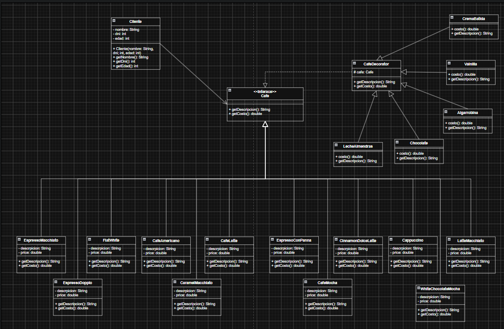

# Tienda virtual de café (StarBU)

- Curso: Patrones de Diseño de Software
- Alumno: Patrones de Diseño de Sofware
- Profesor: Ing. Walter Leturia

Sistema web de tienda de café en línea desarrollado como proyecto académico para el curso de Ingeniería de Software.

El proyecto tiene como objetivo demostrar la aplicación del patrón de diseño **Decorator (GoF)** en un problema real del dominio de cafeterías: la personalización dinámica de bebidas mediante ingredientes adicionales.

---

# 1. Descripción del proyecto

**Coffee Store Online** es una aplicación web que permite a los clientes seleccionar diferentes tipos de café, personalizar sus bebidas agregando ingredientes adicionales, visualizar el precio actualizado y realizar pedidos.

El sistema simula una cafetería moderna donde los usuarios pueden crear bebidas personalizadas combinando productos base con diferentes complementos:

- Leche adicional.
- Chocolate.
- Crema batida.
- Canela.
- Vainilla.
- Caramelo.
- Otros ingredientes disponibles.

La aplicación utiliza el patrón de diseño **Decorator** para agregar responsabilidades y costos adicionales a una bebida sin crear una clase diferente para cada combinación posible.

---

# 2. Problema identificado

Las cafeterías modernas permiten que los clientes personalicen sus bebidas agregando diferentes ingredientes.

Ejemplo:

- Café americano con leche.
- Café americano con leche y caramelo.
- Café americano con leche, caramelo y crema.
- Latte con chocolate y vainilla.

Una implementación tradicional podría crear una clase por cada combinación:

```text
CafeConLeche
CafeConLecheYCaramelo
CafeConLecheCarameloYCrema
LatteConChocolate
LatteConChocolateYVainilla
```

Este enfoque genera problemas:

- Exceso de clases.
- Código difícil de mantener.
- Baja escalabilidad.
- Dificultad para agregar nuevos ingredientes.
- Violación del principio Open/Closed de SOLID.

---

# 3. Justificación del patrón elegido

## Patrón Decorator (GoF)

El patrón Decorator permite añadir nuevas responsabilidades a un objeto dinámicamente sin modificar su estructura original.

En este proyecto:

- La bebida base representa un café simple.
- Los ingredientes adicionales funcionan como decoradores.
- Cada decorador modifica la descripción y el precio final.

Ejemplo:

```text
Espresso
   +
Leche
   +
Caramelo
   +
Crema
```

Resultado:

```text
Espresso con leche, caramelo y crema

Precio:
Precio base + ingredientes adicionales
```

Ventajas:

- Evita crear clases para cada combinación.
- Facilita agregar nuevos ingredientes.
- Mantiene el código extensible.
- Cumple el principio Open/Closed.

---

# 5. Tecnologías utilizadas

## Frontend

- React
- TypeScript
- Tailwind CSS

## Backend

- Node.js
- Express
- TypeScript

## Base de datos

- PostgreSQL

## Herramientas

- Git
- GitHub
- Visual Studio Code
- Postman

---

# 7. Funcionamiento del patrón Decorator

## Paso 1: Selección del café base

El usuario selecciona:

```text
Espresso

Precio:
$3.00
```

---

## Paso 2: Selección de ingredientes

El cliente agrega:

```text
+ Leche ($0.50)
+ Caramelo ($0.70)
+ Crema ($0.80)
```

---

## Paso 3: Construcción de decoradores

Internamente se genera:

```text
CreamDecorator(
    CaramelDecorator(
        MilkDecorator(
            Espresso
        )
    )
)
```

---

## Paso 4: Cálculo del precio

Cada decorador agrega su costo:

```text
Espresso       $3.00
Leche          $0.50
Caramelo       $0.70
Crema          $0.80

Total          $5.00
```

---

# 8. DIagrama UML


